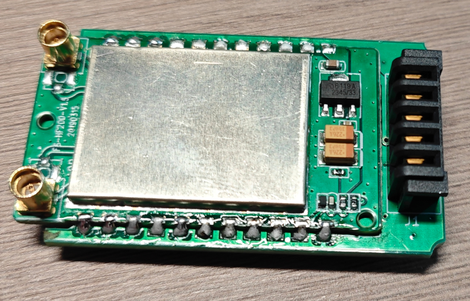
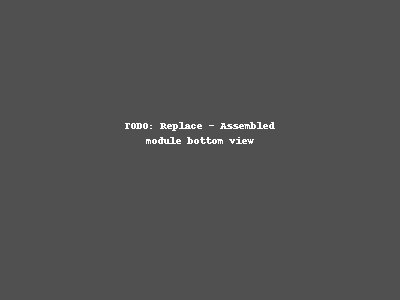
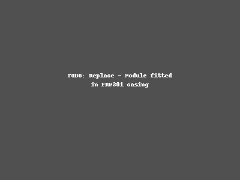
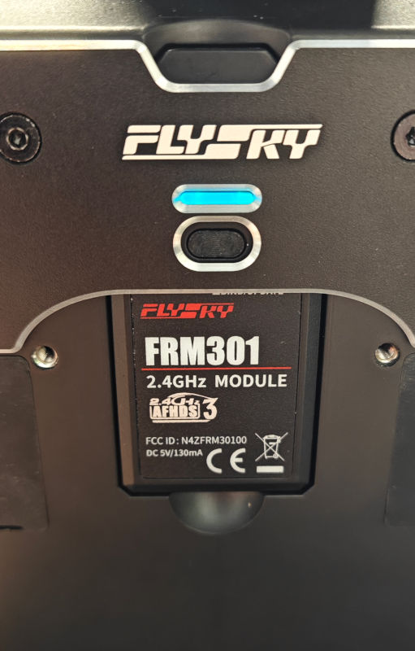

[English](README.md) | [中文](README_CN.md)

# Flysky PL18 ExpressLRS TX Module

A DIY internal ExpressLRS transmitter module for the Flysky Paladin PL18 radio, repurposing the stock FRM301 module's casing and RF module.

## Overview

The Flysky PL18 ships with the FRM301 external TX module. This project replaces the FRM301's internal PCB with a custom carrier board that combines a **Waveshare ESP32-S3-Tiny** as the protocol bridge and the FRM301's **HF200 RF module** as the 2.4GHz ExpressLRS frontend. The result is a fully-featured, drop-in ExpressLRS transmitter module that fits the existing module bay and communicates with the radio over its 5-pin SPORT port.

### Features

- Drop-in replacement for the FRM301 module — reuses the original casing
- Waveshare ESP32-S3-Tiny running ExpressLRS firmware
- HF200 2.4GHz RF module with antenna diversity switching
- Dual WS2812B-2020 RGB status LEDs
- Boot button for easy firmware flashing
- Powered entirely from the radio's 5V rail

## Photos

## Bill of Materials

| Ref | Part | Qty | Notes |
|-----|------|:---:|-------|
| — | PL18-ELRS PCB | 1 | Order using the Gerber files in this repo |
| — | FRM301 donor module | 1 | Harvest the HF200 RF module and the plastic casing |
| U1 | Waveshare ESP32-S3-Tiny | 1 | [Product page](https://www.waveshare.com/esp32-s3-tiny.htm) |
| U2 | HF200 RF module | 1 | Desoldered from the FRM301 |
| D1, D2 | WS2812B-2020 | 2 | 2.0×2.0mm PLCC4 package RGB LED |
| R1, R2 | 10kΩ 0603 resistor | 2 | |
| SW1 | KMR2 tactile switch | 1 | 3.2×4.2mm |
| J1 | 5-pin 2.54mm male header | 1 | DS-B01F-A-S2 or equivalent |

## Pinout

### PL18 Connector (J1)

| Pin | Signal | ESP32-S3 GPIO | Description |
|:---:|:------:|:-------------:|-------------|
| 1 | SPORT | IO04 | S.Port (bidirectional CRSF protocol) |
| 2 | GND | — | Ground |
| 3 | +5V | — | 5V power input from radio |
| 4 | NC | — | Not connected |
| 5 | NC | — | Not connected |

### ESP32-S3 to HF200 RF Module

| ESP32-S3 GPIO | HF200 Pin | Function |
|:-------------:|:---------:|----------|
| IO04 | — | SPORT (to PL18 connector) |
| IO06 | TXEN | TX enable |
| IO07 | RXEN | RX enable |
| IO08 | DI01 | Bidirectional data |
| IO09 | BUSY | Busy status (input) |
| IO10 | SPI_NSS | SPI chip select |
| IO11 | SPI_MOSI | SPI MOSI |
| IO12 | SPI_CLK | SPI clock |
| IO13 | SPI_MISO | SPI MISO |
| IO14 | RESET | HF200 reset |
| IO15 | L_ANT_SW | Left antenna switch |
| IO16 | R_ANT_SW | Right antenna switch |
| IO17 | SW1 | Boot button (active low) |
| IO18 | D1 DIN | WS2812B LED data line |

### Power

| Rail | Source | Supplies |
|------|--------|----------|
| +5V | PL18 connector (J1) | ESP32-S3-Tiny (U1), HF200 (U2) |
| +3V3 | ESP32-S3 internal regulator | WS2812B LEDs (D1, D2), L_POWER pull-up (R2) |

## Schematic & PCB

The PCB design was created in **KiCad 10.0**.

- **Layers:** 2-layer FR4, 1.6mm thickness
- **Copper:** 35μm (1oz)
- **Surface finish:** HASL or ENIG
- **Board shape:** Custom outline matching the FRM301 internal cavity

### KiCad project files

| File | Description |
|------|-------------|
| `PL18_ELRS.kicad_pro` | KiCad project file |
| `PL18_ELRS.kicad_sch` | Schematic |
| `PL18_ELRS.kicad_pcb` | PCB layout |
| `Multi.kicad_sym` | Custom symbol library |
| `Multi.pretty/` | Custom footprint library |

The custom footprints include the `WS_ESP32S3_Tiny` (23-pin SMT module) and `HF200-SMT` (22-pin RF module) footprints matched to the donor parts.

## Assembly

1. **Harvest the HF200.** Open the FRM301 module and carefully desolder the HF200 RF module from the original PCB. Set the plastic casing aside for later use.
2. **Solder the HF200 (U2).** Mount the HF200 module on the **back side** of the PL18-ELRS PCB at the U2 footprint.
3. **Solder the ESP32-S3-Tiny (U1).** Mount on the **front side** at the U1 footprint.
4. **Solder passives and LEDs.** Place R1, R2 (10kΩ 0603), D1, D2 (WS2812B-2020), and SW1 (KMR2 switch) on the **front side**.
5. **Solder the header (J1).** Mount the 5-pin male header on the **back side**, ensuring the pins face toward the rear of the module for proper alignment with the PL18 bay connector.
6. **Fit into the casing.** Insert the assembled PCB into the salvaged FRM301 plastic casing.

## Firmware

The ExpressLRS target definition for the Flysky PL18 is maintained at:

**[github.com/richardclli/ELRS-targets](https://github.com/richardclli/ELRS-targets)**

### Flashing

1. Use the ExpressLRS Configurator and select the **Flysky PL18** target.
2. Connect the ESP32-S3-Tiny via USB to your computer.
3. Hold the boot button (SW1) while applying power (or while connecting USB).
4. Flash the firmware using the configurator.

After flashing, configure ExpressLRS to use the **SPORT** protocol for telemetry.

## Manufacturing

The repository includes a complete set of manufacturing outputs in the root directory:

| File | Description |
|------|-------------|
| `PL18_ELRS-F_Cu.gbr` | Top copper |
| `PL18_ELRS-B_Cu.gbr` | Bottom copper |
| `PL18_ELRS-F_Mask.gbr` | Top solder mask |
| `PL18_ELRS-B_Mask.gbr` | Bottom solder mask |
| `PL18_ELRS-F_Paste.gbr` | Top solder paste |
| `PL18_ELRS-B_Paste.gbr` | Bottom solder paste |
| `PL18_ELRS-F_Silkscreen.gbr` | Top silkscreen |
| `PL18_ELRS-B_Silkscreen.gbr` | Bottom silkscreen |
| `PL18_ELRS-Edge_Cuts.gbr` | Board outline |
| `PL18_ELRS-PTH.drl` | Plated through-hole drill |
| `PL18_ELRS-NPTH.drl` | Non-plated through-hole drill |

To order PCBs, zip all Gerber and drill files and upload to your preferred fab (JLCPCB, PCBWay, etc.) with these specs:

- **Layers:** 2
- **Thickness:** 1.6mm
- **Material:** FR4
- **Copper:** 1oz
- **Surface finish:** HASL (or ENIG for easier hand-soldering)

## License

This project is licensed under the **MIT License** — see the [LICENSE](LICENSE) file for details.
